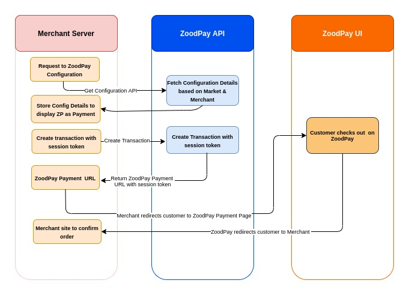

# zoodpay

[](LICENSE.md)
[]()
[](https://packagist.org/packages/zoodpay/laravel-package)

## Install
`composer require zoodpay/laravel-package`

## Usage
Check that ZoodpayServiceProvider is added in the config/app.php, or Manually add it.
```php
 'providers' => [

        /*
         * Laravel Framework Service Providers...
         */
     ...
 Zoodpay\ZoodpayServiceProvider::class,
]
```
Add zoodpay credentials to the config/services.php config file as below.

```php
return [

    ...
 'zoodpay' => [
        'merchant_key' => "",
        'merchant_secret' => "",
        'merchant_salt' => "",
        'merchant_api_url' => "",
        'merchant_api_ver' => "",
        'market_code' => "",
        'currency' =>"",
        'success_url' => "",
        'error_url' => "" ,
        'pending_url' => ""
    ]

```
Available functions:
```php
//Return the ZoodPay Config settings
$this->app->zoodpay->getAPISettings()

//Fetch the merchant configuration. 
$this->app->zoodpay->getZoodPayLimit()

//To verify if ZoodPay need to be shown in Checkout Page
$this->app->zoodpay->availableZoodPayService($amount)

//Fetch the credit balance of a customer.
$this->app->zoodpay->getCreditBalance($phone_number)

//Return ZoodPay Signature for Transaction Signature Verification 
$this->app->zoodpay->getResponseSignature($amount, $merchant_reference_no, $transaction_id)

//Return ZoodPay Refund Signature for Refund Signature Verification 
$this->app->zoodpay->getRefundResponseSignature($merchant_refund_reference, $refund_amount, $status, $refund_id)

/*
 * Create Transaction Using ZoodPay, it will return ZoodPay API response.
 * Initiate the Models and set Values
 * $billing = new Model\BillingShippingInfo();
 * $customer = new Model\CustomerInfo();
 * $items = new Model\ItemsInfo();
 * $order = new Model\OrderInfo();
 * $shippingService = new Model\ShippingServiceInfo();
 * $shipping = $billing;
 * 
*/
$this->app->zoodpay->createTransaction($billing, $customer, $items, $order, $shipping, $shippingService)


/*
 * Set Delivery Date for the Paid Transaction,  it will return ZoodPay API response.
 * Init the Model and set Values
 * Model\DeliveryDate();
 * 
 * */
$this->app->zoodpay->setDeliveryDate($deliveryModel);

/*
 * Create Refund for the Paid Transaction,  it will return ZoodPay API response.
 * Init the Model and set Values
 * Model\CreateRefund()
 * 
 * */
$this->app->zoodpay->createRefund($refundModel);

/*
 * Get Refund Status by Refund id,  it will return ZoodPay API response.
 * Init the Model and set Values
 * Model\CreateRefund()
 * 
 * */
$this->app->zoodpay->getRefundStatusById($refund_id);


```
Process:
ZoodPay Flow

```php
/* 1)
 * To check if ZoodPay need to be Shown in Checkout Page, call this function
 * and based on the available response show the corresponding service
*/
$this->app->zoodpay->availableZoodPayService($amount)

/* 2)
 * User Select ZoodPay Service and Click Pay, Prepare the request and Create Transaction 
 * and function will return ZoodPay API response.  
 * Initiate the Models and set Values
 * $billing = new Model\BillingShippingInfo();
 * $customer = new Model\CustomerInfo();
 * $items = new Model\ItemsInfo();
 * $order = new Model\OrderInfo();
 * $shippingService = new Model\ShippingServiceInfo();
 * $shipping = $billing;
 * 
 * API Response :
 * 
 * Transaction created: {"session_token":"YYYYYYYYYYYYYYYYYYYY","transaction_id":"407879856581528","expiry_time":"2021-12-22T16:58:49Z","payment_url":"https://b2c.zoodpay.com/index.php?XXXXXXXXXXXXXXXXXXXXXXXXXXXX","signature":"96496a0ae20cf58d936d195fd1d0b19526201313f7af97aae3e99610e314294dc3d66c9d3881d06994af273b25bb115bf5eef5b21806f24b5bd61b37f2387be7"}
 * 

 * 
*/
$this->app->zoodpay->createTransaction($billing, $customer, $items, $order, $shipping, $shippingService);


/*
 * 3)
 * Verify the Signature by  Calling below function and if the signature match, 
 * do necessary changes and save transaction_id as reference and redirect user to ZoodPay UI .
 * 
 * */
 $this->app->zoodpay->getResponseSignature($amount, $merchant_reference_no, $transaction_id)
 

/*
 * 4)
 * User will be redirected to the Callback Http/Controller/Callback.php, 
 * change your Order Status Accordingly in each Action. 
 */
 
 /*
  * 5)
 * Set Delivery Date for the Paid Transaction,  it will return ZoodPay API response.
 * Init the Model and set Values
 * Model\DeliveryDate();
 * 
 * */
$this->app->zoodpay->setDeliveryDate($deliveryModel);
 
 
 /*
  * 6)
 * Create Refund for the Paid Transaction,  it will return ZoodPay API response.
 * Init the Model and set Values
 * Model\CreateRefund()
 * 
 * */
$this->app->zoodpay->createRefund($refundModel);


```

## Testing
Run the tests with:
load the phpunit.xml and change
``` bash
$ /usr/bin/php /path to laravel/vendor/phpunit/phpunit/phpunit --configuration /path to laravel/packages/zoodpay-laravel/phpunit.xml
```

## Changelog
Please see [CHANGELOG](CHANGELOG.md) for more information what has changed recently.

## Contributing
Please see [CONTRIBUTING](CONTRIBUTING.md) for details.

## Credits

- [ZoodPay](https://github.com/zood)
- [All Contributors](https://github.com/zood/zoodpay/contributors)

## Security
If you discover any security-related issues, please email mohammadali.namazi@zoodpay.com instead of using the issue tracker.

## License
The MIT License (MIT). Please see [License File](/LICENSE.md) for more information.
